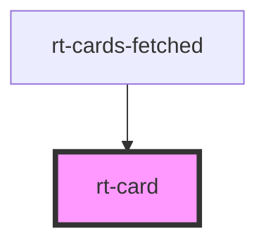

# rt-card

<!-- Auto Generated Below -->

## Properties

| Property   | Attribute  | Description | Type     | Default     |
| ---------- | ---------- | ----------- | -------- | ----------- |
| `email`    | `email`    |             | `string` | `undefined` |
| `names`    | `names`    |             | `string` | `undefined` |
| `surnames` | `surnames` |             | `string` | `undefined` |
| `uid`      | `uid`      |             | `string` | `undefined` |

## Dependencies

### Used by

 - [rt-cards-fetched](../rt-cards-fetched)

### Graph

----------------------------------------------

*Built with [StencilJS](https://stenciljs.com/)*
