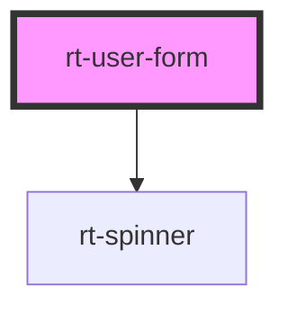

# rt-user-form

<!-- Auto Generated Below -->

## Properties

| Property  | Attribute  | Description | Type      | Default     |
| --------- | ---------- | ----------- | --------- | ----------- |
| `btnName` | `btn-name` |             | `string`  | `''`        |
| `uid`     | `uid`      |             | `string`  | `undefined` |
| `view`    | `view`     |             | `boolean` | `false`     |

## Dependencies

### Depends on

- [rt-spinner](../rt-spinner)

### Graph

----------------------------------------------

*Built with [StencilJS](https://stenciljs.com/)*
